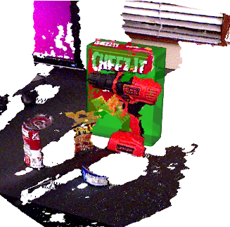
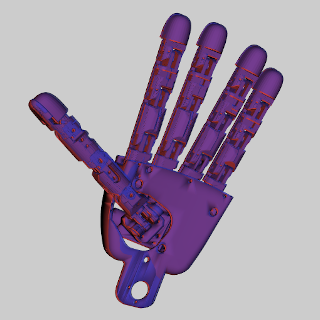

# RobotsViz
## [WIP]

Small C++ library for representing meshes and point clouds in a VTK viewer.


  

### Dependencies

- [`Eigen 3`](http://eigen.tuxfamily.org/index.php?title=Main_Page)
- [`OpenCV`](https://opencv.org/)
- [`RobotsIO`](https://github.com/xenvre/robots-io)
- [`VTK`](https://vtk.org/)

#### Optional

If the following are enabled, some functionalities related to the iCub robot and/or YARP are also available.

- [`SuperimposeMesh`](https://github.com/robotology/superimpose-mesh-lib)
- [`YARP`](https://github.com/robotology/yarp)


#### Installation

```
git clone https://github.com/xenvre/robots-viz.git
cd robots-viz
mkdir build
cd build
cmake -DCMAKE_PREFIX_PATH=<installation_path> [-DUSE_YARP=ON] [-DUSE_SUPERIMPOSE=ON] ../
make install
```

### Classes

- `VtkContainer`: hosts the main `VTK` threaded viewer and a variable number of `VtkContent`-s;
- `VtkContent`: abstract class for a content to be displayed;
- `VtkPointCloud`: point cloud obtained from the depth channel of a `RobotsIO::Camera::Camera`;
- `VtkMeshOBJ`: mesh obtained from a OBJ file;
- `VtkiCubHand`: visualization of the `iCubHand` (left only, right to be added soon) (requires `YARP`)
- `SIiCubHand`: rendering of the contour of a `iCubHand` according to the point of view of a `RobotsIO::Camera::Camera` (requires `YARP` and `SuperimposeMesh`)

